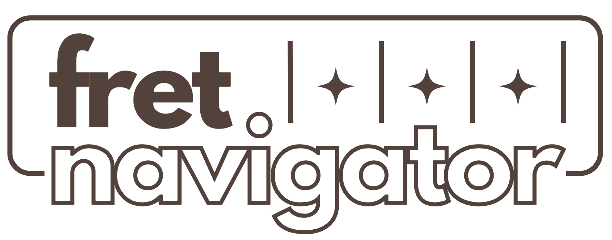
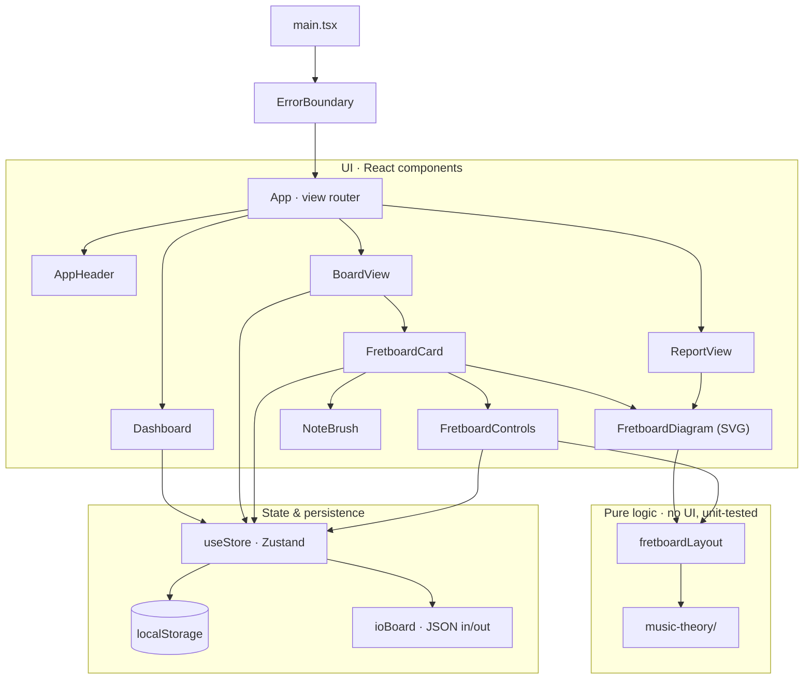
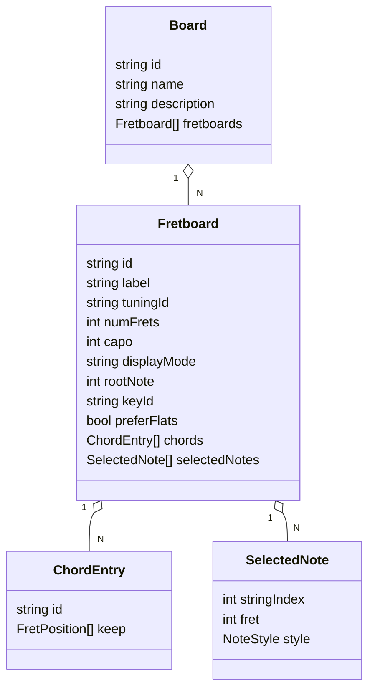

<p align="center">
  
</p>

<p align="center">
  Visualize and interact with the guitar fretboard — notes, intervals, keys and chords —<br>
  organized into <strong>boards</strong> per song, with configurable per-note color highlighting.
</p>

---

Built with **React + TypeScript + Vite**, Zustand for state, and a pure, testable `music-theory/` module. The fretboard is rendered in **SVG** for crisp styling, hover/click interaction, and clean printing. The interface uses a warm, editorial **brown design system** with the **Literata** typeface.

## Features

- **Boards → Fretboards hierarchy.** A board (e.g. _"Jungle – Tash Sultana"_) holds any number of independent fretboards (e.g. _Chords_, _Solo – Verse_, _Solo – Chorus_). Create, rename, duplicate, delete, reorder.
- **Configurable fretboards:** tuning (standard + drop D, DADGAD, open G/D, half-step down), fret count (5–24), capo.
- **Notes / Intervals toggle.** In intervals mode the chosen root shows **R** and the major-scale degrees show **2–7**; non-scale notes are left blank. The root comes from the Root selector _or_ simply the first note you pin on the fretboard.
- **Key selector.** Highlights all notes of a key (major, the modes, harmonic/melodic minor, pentatonics, blues) in a neutral base color.
- **Chord progressions.** Add several chords to one fretboard, each in its own color. All show at once; notes shared by multiple chords are **split into colored wedges** (common tones), and each chord's root is emphasized. Click a chip to **isolate** one chord.
- **Chord voicings.** Focus a chord and _"Select notes to keep"_ → click the exact positions of a shape, then **Remove Unselected Notes** to narrow that chord to your voicing.
- **Manual note pinning** with a color brush: preset fills + independent **outline** presets + free color pickers + dashed outline.
- **Report view.** A clean, consolidated, print-ready page of every fretboard — print to PDF via the browser.
- **Local persistence** in `localStorage` (versioned schema with automatic migrations) and **per-board JSON export/import**.

## Getting started

Requires **Node.js 18+**.

```bash
npm install
npm run dev        # start the dev server (http://localhost:5173)
```

Other scripts:

```bash
npm run build      # type-check + production build
npm run preview    # preview the production build
npm test           # run the music-theory unit tests (Vitest)
```

## Architecture

Three clean layers — **UI** (React), **pure logic** (no UI, unit-tested), and **state & persistence** (Zustand + `localStorage`). UI reads/writes the store and renders via the pure logic; the pure logic never imports UI.



### Data model



### Source layout

```
src/
├── music-theory/          # pure, UI-free, unit-tested
│   ├── notes.ts           # pitch classes, naming, parsing
│   ├── intervals.ts       # interval labels + color convention
│   ├── scales.ts          # scale/key formulas
│   ├── chords.ts          # chord formulas, tone roles, display names
│   └── fretboard.ts       # tunings + (string, fret) → pitch
├── store/
│   ├── useStore.ts        # Zustand store + persist + schema migrations
│   ├── factories.ts       # board/fretboard/chord factories + normalizers
│   ├── colorPresets.ts    # brush + chord palettes
│   └── ioBoard.ts         # per-board JSON export / import
├── components/
│   ├── App / AppHeader / Dashboard / BoardView / ReportView
│   ├── FretboardCard      # one interactive fretboard (state orchestration)
│   ├── FretboardControls  # tuning, key, chord progression, refine bar
│   ├── FretboardDiagram   # SVG rendering (interactive + report)
│   ├── fretboardLayout.ts # pure geometry + highlight computation
│   ├── NoteBrush / IntervalLegend / ErrorBoundary
└── types.ts               # domain model (Board, Fretboard, ChordEntry, …)
```

### How highlighting layers work

For each fret position the app computes a single highlight by priority:

1. **Manual** pinned note (your brush color/outline) — always wins.
2. **Chord** progression tone — one color per chord; a wedge-split circle when a note belongs to several chords.
3. **Key** membership — neutral base color.
4. **Interval** degree (intervals mode) — root + major-scale tones.
5. Otherwise a low-key note-map cell.

## Out of scope (v1)

No login / multi-user (everything is local), no audio/mic tuning, no full tablature — the focus is exclusively the fretboard diagram.
