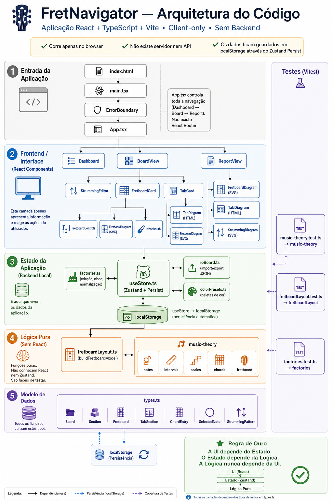
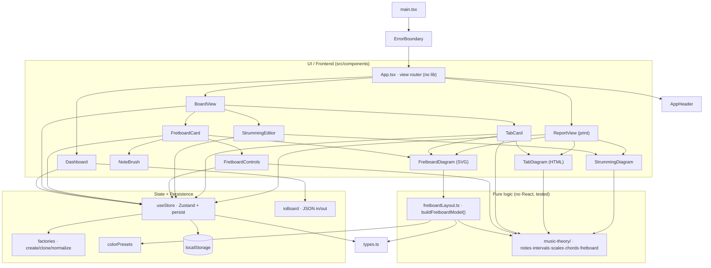

# Architecture

A map of the codebase: the main files, what they do, and how they depend on
each other. For the *why* behind non-obvious choices see [decisions.md](decisions.md);
for open work see [todo.md](todo.md).

## Overview

FretNavigator is a **client-only** app (runs entirely in the browser) — **no
backend, no server, no API, no login**. Stack: **React + TypeScript + Vite**,
state via **Zustand + persist** (saved to the browser's `localStorage`). There
is **no router** — navigation is a small state machine in `App.tsx`.

The code splits into **three layers** with a strict dependency direction:

> **UI (React)** → **State + Persistence** → **Pure logic (no React)**

The pure logic never imports UI. "Backend" here means the state + persistence
layer (`src/store/`), which persists locally — there is no network tier.

## Layers & main files

### Entry / shell
| File | Role |
| --- | --- |
| `index.html` | HTML root, favicon, mounts `#root`. |
| `src/main.tsx` | React bootstrap; wraps `<App/>` in `<ErrorBoundary>`; imports the Literata font + `index.css`. |
| `src/App.tsx` | Top of the UI; **no router**; `view` state union `dashboard \| board \| report`; renders `AppHeader` + the active view. |
| `src/components/AppHeader.tsx` | Persistent top bar (logo, breadcrumb, GitHub link). |
| `src/components/ErrorBoundary.tsx` | Catches render errors, shows a recovery screen. |

### UI / Frontend (`src/components/`)
| File | Role |
| --- | --- |
| `Dashboard.tsx` | List of boards (create / open / duplicate / delete / import-export). |
| `BoardView.tsx` | Edit one board: name/description, `StrummingEditor`, the ordered list of **sections** (`FretboardCard` / `TabCard`), "+ Add fretboard" / "+ Add tab". |
| `FretboardCard.tsx` | One interactive fretboard section: controls + diagram + brush; owns transient local state (chord focus/refine). |
| `FretboardControls.tsx` | Tuning, frets, capo, notes/intervals, key, chord progression. |
| `FretboardDiagram.tsx` | **SVG renderer** of a fretboard model (interactive *or* static); shared by the card **and** the report. |
| `NoteBrush.tsx` | Color/outline brush for pinning notes. |
| `StrummingEditor.tsx` | Board-level strumming pattern editor (palette). |
| `StrummingDiagram.tsx` | Pure SVG render of a strumming pattern (editor + report). |
| `TabCard.tsx` | Tab (tablature) section editor: keyboard grid + fretboard-click input. |
| `TabDiagram.tsx` | Pure HTML render of a tab (editor + report). |
| `ReportView.tsx` | Consolidated, print-ready page; **hybrid pagination**; renders the diagrams statically. |
| `IntervalLegend.tsx` | ⚠️ Interval-color legend — **currently orphaned** (defined but imported nowhere; dead code). |

### Pure logic (no React, unit-tested)
| File | Role |
| --- | --- |
| `src/components/fretboardLayout.ts` | The **heart**: `buildFretboardModel()` turns a `Fretboard` into geometry + a per-cell highlight model (priority `manual > chord > key > interval > plain`). Also `effectiveRootNote`, `computeHighlight`, `GEOM`. (Lives in `components/` but is pure.) |
| `src/music-theory/notes.ts` | Pitch classes 0–11, note naming, `mod12`. |
| `src/music-theory/intervals.ts` | Interval labels + color convention. |
| `src/music-theory/scales.ts` | Scale/key formulas, `parseKeyId`. |
| `src/music-theory/chords.ts` | Chord formulas, `chordToneRoles`, `parseChordId`, `chordDisplayName`. |
| `src/music-theory/fretboard.ts` | `TUNINGS`, `getTuning`, `pitchAt` (string+fret → pitch), inlay dots. |
| `src/music-theory/index.ts` | Barrel re-exporting the five modules above. |

### State + Persistence ("backend" = local)
| File | Role |
| --- | --- |
| `src/store/useStore.ts` | The **Zustand store**: `boards` + all actions (board / section / fretboard / tab / note level); `persist` config with `version = SCHEMA_VERSION`; `migrate()` + `merge()` (self-heal via `normalizeSections`/`normalizeChords`); `useBoard` selector. Writes to `localStorage`. |
| `src/store/factories.ts` | Constructors + normalizers: `createBoard/createFretboard/createTabSection/createStrummingPattern`, `clone*`, `normalizeChords/normalizeSections`, `uid`. |
| `src/store/colorPresets.ts` | Color palettes (brush, `CHORD_PALETTE`, default note style). |
| `src/store/ioBoard.ts` | Per-board JSON export/import (`serialize/deserialize/downloadBoard`). |

### Types
| File | Role |
| --- | --- |
| `src/types.ts` | Domain model: `Board`, `Section` (= `Fretboard \| TabSection`), `Fretboard`, `TabSection`/`TabColumn`, `ChordEntry`, `SelectedNote`, `StrummingPattern`, `NoteStyle`, `SCHEMA_VERSION`. Imported almost everywhere. |

## Tests (Vitest, co-located `*.test.ts`, run with `npm test`)
- `src/music-theory/music-theory.test.ts` — music theory (notes, intervals, scales, chords).
- `src/components/fretboardLayout.test.ts` — `buildFretboardModel` (highlights, `keep` voicing, refine).
- `src/store/factories.test.ts` — factories, `normalizeSections`, clones, strumming/tab.

## Build / config / deploy
- `vite.config.ts` — Vite + React plugin; `base = /FretNavigator/` in production; Vitest config.
- `tsconfig*.json`, `package.json` (scripts `dev`/`build`/`test`; deps: react, zustand, @fontsource-variable/literata).
- `.github/workflows/deploy.yml` — CI: build + test + deploy to **GitHub Pages**.
- `public/` — `logo.png`, `icon.svg`.

## Visual diagram

Two renderable sources of the same map:

- **`architecture.dot`** (Graphviz) — the richer, layered file map. Render with
  `dot -Tsvg architecture.dot -o architecture.svg`, or paste it into an online
  viewer (e.g. dreampuf.github.io/GraphvizOnline, edotor.net).
- The **Mermaid** diagram below renders directly on GitHub / in Markdown viewers.

